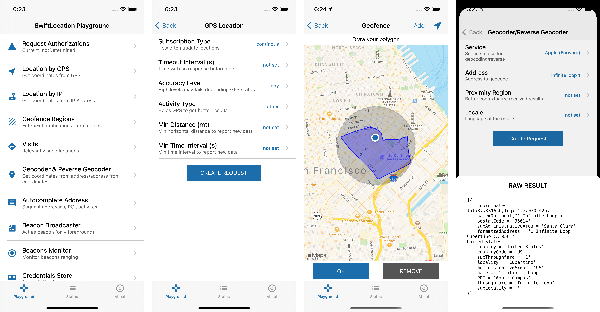

<p align="center" >
  
</p>

<p align="center"><strong>Location Manager Made Easy</strong></p>

SwiftLocation is a lightweight Swift Library that provides an easy way to work with location-related functionalities. 
No more pain with delegates or callbacks but a simple request based architecture with multiple subscriptions and automatic tuning of the core location manager's settings.

|   | Feature  | Description  |
|---|---|---|
| 🛰 | **Location via GPS**  |  Monitor single, continuous or significant location updates with fully configurable APIs.  |
| 👩‍💻 | **Location via IP** | Approximate location data without user authorization.<br>[IPApi](https://ipapi.com) ∙ [IPData](https://ipdata.co) ∙ [IPGeolocation](http://ipgeolocation.io) ∙ [IPInfo](http://ipinfo.io) ∙ [IPify](https://www.ipify.org) ∙ [IPStack](https://ipstack.com).  |
| 🛴 | **Geofencing** | Supports monitoring of circular regions and custom polygons.  
| 🌍 | **Gecoder<br>Reverse Geocoder** | Get address from coordinates and viceversa.<br>[Apple](https://developer.apple.com/documentation/corelocation/clgeocoder) ∙ [Google](https://developers.google.com/maps/documentation/geocoding/) ∙ [Here](https://developer.here.com/documentation/geocoder) ∙ [MapBox](https://docs.mapbox.com/help/how-mapbox-works/geocoding/) ∙ [OpenStreet](https://nominatim.openstreetmap.org/ui/search.html).
| 🏠 | **Autocomplete**  | Suggestions & details for addresses, places or POIs.<br>[Apple](https://developer.apple.com/documentation/mapkit/mklocalsearchcompleter) ∙ [Google](https://developers.google.com/maps/documentation/javascript/places-autocomplete) ∙ [Here](https://developer.here.com/documentation/geocoder-autocomplete). |
| 📍 | **Beacon**  | Beacons ranging, monitoring. |
| 📡 | **Beacon Broadcaster**  | Broadcast beacon from the app *(only foreground)*. |
| 🏞 | **Visits**  | Significant visited location monitoring. |

## 🤾 Play Now!

SwiftLocation comes with a playground application you can use to learn how to use the lib or just play with each supported feature!

<center></center>

<a name="support"/>

## ❤️ Your Support

*Hi fellow developer!*  
You know, maintaining and developing tools consumes resources and time. While I enjoy making them **your support is fundamental to allow me to continue its development**.  

If you are using SwiftLocation or any other of my creations please consider the following options:

- [**Make a donation with PayPal**](https://www.paypal.com/paypalme/danielemargutti/20)
- [**Become a Sponsor**](https://github.com/sponsors/malcommac)

- [Follow Me](https://github.com/malcommac)

## Introduction

It's pretty easy to use; all the features are accessible through the `SwiftLocation` object. 

Each feature creates and adds to a pool manager a new request (conforms to `RequestProtocol` protocol) object you can use to get the results or fine-tuning its configuration.  

Result is a `Result<Data, LocationError>` object (where `Data` is a struct/class which depends on the request).  
You can manage as you want but SwiftLocation also exposes two optional properties:
- `.error` to get the error produced (`LocationError?`)
- `.data` to get the result produced (`<RequestInstance>.ProducedData`?)

All requests are retained automatically so you don't need to keep them alive until they're running.

You can add one or more subscriptions to get the produced data by calling `then()` operator on request (optionally you can specify the `DispatchQueue` where result is returned, by default is `.main`).

To cancel/stop a running request (ie. a continuous location update) call `cancelRequest()` on it: it will remove the request from the queue and adjust core location settings based upon remaining requests if needed. 

To temporarily pause a request while still in queue use `.isEnabled` property.

## Discover Features

- [Getting user location via GPS](#gps)
- [Getting the last known location](#last_known_location)
- [Geocoder & Reverse Geocoder](#geocoder)
- [Get Location By IP Address](#iplocation)
- [Autocomplete Addresses](#autocomplete)
- [Geofencing Regions](#geofencing)
- [Significant Visits Monitoring](#visits)
- [Beacon Ranging](#beacon)
- [Beacon Broadcaster](#beaconbroadcaster)
- [User Authorization Request](#authorization)
- [Background Location Updates](#backgroundupdates)
- [Precise & Reduced Location in iOS 14+](#precisereducedlocation)

<a name="gps"/>

### Getting user location via GPS

Just one line of code:

```swift
SwiftLocation.gpsLocation().then {
    print("Location is \($0.location)")
}
```

**Remember**: Before using SwiftLocation you should set the appropriate keys in your Info.plist (`NSLocationAlwaysAndWhenInUseUsageDescription` or `NSLocationWhenInUseUsageDescription` and `NSLocationTemporaryUsageDescriptionDictionary` if you are using reduced location in iOS 14+).

If you need more customization you can fine-tune your request by configuring each of the available parameters. This is a more complex example: 

```swift
SwiftLocation.gpsLocationWith {
    // configure everything about your request
    $0.subscription = .continous // continous updated until you stop it
    $0.accuracy = .house 
    $0.minDistance = 300 // updated every 300mts or more
    $0.minInterval = 30 // updated each 30 seconds or more
    $0.activityType = .automotiveNavigation
    $0.timeout = .delayed(5) // 5 seconds of timeout after auth granted
}.then { result in // you can attach one or more subscriptions via `then`.
    switch result {
    case .success(let newData):
        print("New location: \(newData)")
    case .failure(let error):
        print("An error has occurred: \(error.localizedDescription)")
    }
}
```

`.significant` subscription requires always authorization and works even in the background.  

If the app is not running and it's resumed by the system GPS request is restored for you by SwiftLocation, so you can bind your own subscriptions.  

```swift
func application(_ application: UIApplication, didFinishLaunchingWithOptions launchOptions: [UIApplication.LaunchOptionsKey: Any]?) -> Bool {
    // The best place to resume your requests is the app launch.
    SwiftLocation.onRestoreGPS = { requests in
        for request in requests {
            request.then {
                // do anything or bind to your own classes
            }
        }
    }
    ...
}
```

<a name="last_known_location"/>

### Getting the last known location

SwiftLocation store automatically the last known location, even between re-launches of the app:

```swift
let location = SwiftLocation.lastKnownGPSLocation
```

<a name="geocoder"/>

### Geocoder & Reverse Geocoder

Geocoding is the process of converting addresses (like a street address) into geographic coordinates which you can use to place markers on a map, or position the map.  
Reverse geocoding is the process of back (reverse) coding of a point location to a readable address or place name.

Let me show how you can use Apple service to get the coordinates of a famous place:

```swift
let service = Geocoder.Apple(address: "1 infinite loop cupertino")
SwiftLocation.geocodeWith(service).then { result in
    // You will get an array of suggested [GeoLocation] objects with data and coordinates
    print(result.data)
}
```

Reverse geocoding still straighforward. This is an example using google:

```swift
let service = Geocoder.Google(lat: 37.331656, lng: -122.0301426, APIKey: "<your api key>")
SwiftLocation.geocodeWith(service).then { result in
    // Different services, same expected output [GeoLocation]
    print(result.data)
}
```

As you noticed there are no differences in expected output; all services return the same output, an array of `[GeoLocation]` objects which contain the data fetched *(please refer to the doc for further details)*.

As you see some services require API Keys; it's really boring passing the key to each request uh?  
If you plan to use the same key for all services of a family consider using the shared credentials store:

```swift
SwiftLocation.credentials[.google] = "<google api key>" // setup the key

// you can now omit the APIKey parameter in your google requests!
// SwiftLocation will automatically read the shared credentials value!
let service = Geocoder.Google(address: "Via Roma 1, Milano")
SwiftLocation.geocodeWith(service).then { result in
    // ...
}
```

Each service has its unique settings you can configure (see the complete doc here).  
Once you created the service object you can configure its own settings before sending it to the requests pool:

```swift
let service = Geocoder.MapBox(address: "Trafalgar Square")
// MapBox service has lots of configuration available to get better results
service.locale = "en"
service.limit = 1
service.boundingBox = Geocoder.MapBox.BoundingBox(minLat: 40.7661, minLon: -73.9876,
                                                  maxLat: 40.8002, maxLon: -73.9397)
service.resultTypes = [.place]
SwiftLocation.geocodeWith(service).then { result in
    print(result.data) // different services, same expected output [GeoLocation]
}
```

It supports the following services *(some of these require API keys)* under the `Geocoder` umbrella *(check the documentation for more infos)*:

- [`Geocoder.Apple`](Sources/SwiftLocation/Request/Requests/Geocoder/Services/Geocoder-Apple.swift)
- [`Geocoder.Google`](Sources/SwiftLocation/Request/Requests/Geocoder/Services/Geocoder-Google.swift)
- [`Geocoder.Here`](Sources/SwiftLocation/Request/Requests/Geocoder/Services/Geocoder-Here.swift)
- [`Geocoder.MapBox`](Sources/SwiftLocation/Request/Requests/Geocoder/Services/Geocoder-MapBox.swift)
- [`Geocoder.OpenStreet`](Sources/SwiftLocation/Request/Requests/Geocoder/Services/Geocoder-OpenStreet.swift)

<a name="iplocation"/>

### Get Location By IP Address

Sometimes you don't need a precise location and don't want to bother your user authorizing the app to get it.  
In these cases, you can use one of the six services available to get an approximate location (plus some other location data) just by using location by IP service.

The following example shows how to get an `IPLocation.Data` object with all the info retrieved from the current device's IP address *(you can also specify other IP addresses in init of the service)*.

```swift
SwiftLocation.ipLocationWith(IPLocation.IPData()).then { result in
    print(result.location.coordinates)
    // get the city and other data from .info dictionary
    print(result.location.info[.city])
    print(result.location.info[.countryCode])
}
```

It supports the following services *(some of these require API keys)*. Check the single class to read custom configurations:

- [`IPLocation.IPApi`](Sources/SwiftLocation/Request/Requests/IPLocation/Services/IPLocation-IPApi.swift)
- [`IPLocation.IPData`](Sources/SwiftLocation/Request/Requests/IPLocation/Services/IPLocation-IPData.swift)
- [`IPLocation.IPGeolocation`](Sources/SwiftLocation/Request/Requests/IPLocation/Services/IPLocation-IPGeolocation.swift)
- [`IPLocation.IPInfo`](Sources/SwiftLocation/Request/Requests/IPLocation/Services/IPLocation-IPInfo.swift)
- [`IPLocation.IPIpify`](Sources/SwiftLocation/Request/Requests/IPLocation/Services/IPLocation-IPIpify.swift)
- [`IPLocation-IPStack`](Sources/SwiftLocation/Request/Requests/IPLocation/Services/IPLocation-IPStack.swift)

<a name="autocomplete"/>

### Autocomplete Addresses

You can use autocomplete to give your applications the type-ahead-search behavior of the Maps apps search field. The autocomplete service can match on full words and substrings, resolving place names, addresses, and plus codes (1). Applications can therefore send queries as the user types, to provide on-the-fly place predictions.

You can also get the detailed info about predictions, ie when the user tap on one of the suggestions and you need to get the coordinates and other data (2).

Services are available under the `Autocomplete` umbrella and supports.  
You can create two kinds of autocomplete:  
- (1) search for full words and substrings (`.init(partialMatches: ...`)
- (2) place details (`.init(detailsFor: ...)`)

```swift
let australia = MKCoordinateRegion(center: CLLocationCoordinate2D(latitude: -33.269290, longitude: 150.479955), latitudinalMeters: 20000, longitudinalMeters: 20000)

let service = Autocomplete.Apple(partialMatches: "Mart", region: australia)
SwiftLocation.autocompleteWith(service).then { result in
    // You get an array of `PartialAddressMatch`
    // From this array you can obtain infos with (2).
    //
    // Martial Arts Search Nearby, 
    // Mart Search Nearby, Martinsville,
    // NSW, Australia
    // ...
    let partialMatches = result.data.map { $0.partialAddress }
}
```

Now suppose you want to get more info from the first result `Martial Arts Search Nearby`.  
Just call the service with it:

```swift
let detailService = Autocomplete.Apple(detailsFor: partialMatches.first)
SwiftLocation.autocompleteWith(detailService).then { result in
    // Extract the array of found `GeoLocation` places
    let places = result.data?.map({ $0.place })
    let firstResult: GeoLocation = places?.first
    print(firstResult.coordinates) // coordinates
    // .info contains additional fetched information depending from used service
    print(firstResult.info[.formattedAddress])
    print(firstResult.info[.subAdministrativeArea]) 
    // ...
}
```

There is no difference if you are using `Autocomplete.Google(partialMatches: "...")` about expected result types, but `info` dictionary may contain more or less data.  
Of course different services exposes different settings:

```swift
let service = Autocomplete.Google(partialMatches: "Mart")
// See the doc for all settings each service exposes!
service.placeTypes = [.cities, .address]
service.radius = 500
service.strictBounds = true
SwiftLocation.autocompleteWith(detailService).then { ... }
```

It supports the the following Geofencing services available under `Autocomplete` umbrella *(check the documentation for more infos)*:

- [`Autocomplete.Apple`](Sources/SwiftLocation/Request/Requests/Autocomplete/Services/Autocomplete-Apple.swift)
- [`Autocomplete.Google`](Sources/SwiftLocation/Request/Requests/Autocomplete/Services/Autocomplete-Google.swift)
- [`Autocomplete.Here`](Sources/SwiftLocation/Request/Requests/Autocomplete/Services/Autocomplete-Here.swift)


<a name="geofencing"/>

### Geofencing Regions

Geofence is a virtual perimeter for a real-world geographic area.  
An example of geofencing usage involves a location-aware device of a location-based service (LBS) user entering or exiting a geo-fence.  

With SwiftLocation you can monitor:  
- circular region
- custom polygon region *(actually it does not work correctly so avoid it)*

```swift
let options = GeofencingOptions(circleWithCenter: CLLocationCoordinate2D(latitude: 3, longitude: 2), radius: 100)
SwiftLocation.geofenceWith(options).then { result in
    guard let event = result.data else { return }

    switch event {
    case .didEnteredRegion(let r):
        print("Triggered region entering! \(r)")
    case .didExitedRegion(let r):
        print("Triggered region exiting! \(r)")
    default:
        break
    }
}
```

To monitor a custom polygon just create the appropriate [`GeofencingOptions`](Sources/SwiftLocation/Request/Requests/Geofencing/GeofencingOptions.swift) to pass `let options GeofencingOptions(polygon: <MKPolygon>)`.

Geofencing also works in background and app killed. You can restore saved session and bind to your own trigger event directly at startup:

```swift
func application(_ application: UIApplication, didFinishLaunchingWithOptions launchOptions: [UIApplication.LaunchOptionsKey: Any]?) -> Bool {
    // The best place to resume your requests when app is killed
    SwiftLocation.onRestoreGeofences = { requests in // do anything you want }
}
```

<a name="visits"/>

### Significant Visits Monitoring

Sometimes you may need to monitor updates only when the user’s movements are noteworthy.
The visits service is the most power-efficient way of gathering location data.  
Each update includes both the location and the amount of time spent at that location. 
This service isn’t intended for navigation or other real-time activities ([Read More](https://developer.apple.com/documentation/corelocation/getting_the_user_s_location/using_the_visits_location_service)).

```swift
// You can also specify an activity To help the system determine how to manage the battery use.
SwiftLocation.visits(activityType: .fitness).then { result in
    print("A new visits to \(result.data)")
}
```

This also works in the background when an app is killed, so you can restore it in your app launch if you need to trigger some events.

```swift
func application(_ application: UIApplication, didFinishLaunchingWithOptions launchOptions: [UIApplication.LaunchOptionsKey: Any]?) -> Bool {
    // The best place to resume your requests when app is killed
    SwiftLocation.onRestoreVisits = { requests in // do anything you want }
}
```

<a name="beacon"/>

### Beacon Monitoring

An iBeacon is a device that emits a Bluetooth signal that can be detected by your devices. 
You decide what actions to take based on the proximity of nearby beacons ([Read More](https://developer.apple.com/documentation/corelocation/determining_the_proximity_to_an_ibeacon_device)).

```swift
let beacon = BeaconRequest.Beacon(uuid: <UUID>, minor: <MinorID>, major: <MajorID>)
SwiftLocation.beacon(beacon).then { result in
    guard let event = result.data else { return }
    switch event {
    case .rangingBeacons(let b):
        print("Ranged beacon: \(b)")
    case .didEnterRegion(let r):
        print("Did enter in region: \(r)")
    case .didExitRegion(let r):
        print("Did exit in \(r)")
    }
}
```

You can of course monitor more than one beacon or a family UUID:

```swift
SwiftLocation.beacon(BeaconRequest(UUIDs: [<UUID_Family1>,<UUID_Family2>])).then { ... }
```

<a name="beaconbroadcaster"/>

### Beacon Broadcaster

Sometimes you may need to broadcast your app as a beacon. SwiftLocation allows you to do it (however due to iOS limitations it will work only in the foreground with the app open).

```swift
let beaconToSimulate = BroadcastedBeacon(UUID: <UUID>, 
                                        majorID: <MajorID>, minorID: <MinorID>, 
                                        identifier: <Identifier>)
SwiftLocation.broadcastAsBeacon(beaconToSimulate)
```

`SwiftLocation.stopBroadcasting()` allows you to stop broadcasting, while `SwiftLocation.isBeaconBroadcastActive` allows you to check if broadcasting is active or not.

<a name="authorizations"/>

### User Authorization Request

Typically you don't need to manage authorization manually because SwiftLocation will handle it based upon the request you add to the pool manager and your `Info.plist` configuration (you can force preferred authorization mode by setting `SwiftLocation.preferredAuthorizationMode = <AuthorizationMode>`; by default is `.plist`).

However if you need to request authorization manually you can still use:

```swift
SwiftLocation.requestAuthorization(.onlyInUse) { newStatus in
    print("New status \(newStatus.description)")
}
```

To get the current authorization status use  
`let currentStatus = SwiftLocation.authorizationStatus`

<a name="backgroundupdates"/>

### Background Location Updates

In order to get continous updates of location in background you need to specify the appropriate Background Capabilities > Location Updates in "Signining & Capabilities" of your Xcode project.  
Moreover you should set to the `SwiftLocation.allowsBackgroundLocationUpdates = true` a

Optionally you can also set `SwiftLocation.pausesLocationUpdatesAutomatically = true` allowing the location manager to pause updates can improve battery life on the target device without sacrificing location data. When this property is set to true, the location manager pauses updates (and powers down the appropriate hardware) at times when the location data is unlikely to change. For example, if the user stops for food while using a navigation app, the location manager might pause updates for a period of time. You can help the determination of when to pause location updates by assigning a value to the activityType property.

Finally if your app is stopped all your requests are saved automatically and can be restored in early stage of the application's launch like in this example:

```swift
func application(_ application: UIApplication, didFinishLaunchingWithOptions launchOptions: [UIApplication.LaunchOptionsKey: Any]?) -> Bool {
    // The best place to resume your requests is the app launch.
    SwiftLocation.onRestoreGPS = { requests in ... }
    SwiftLocation.onRestoreVisits = { requests in ... }
    SwiftLocation.onRestoreGeofences = { requests in ... }
    ...
}
```

If you want to disable automatic requests save you can set the `SwiftLocation.automaticRequestSave = false`.

<a name="precisereducedlocation"/>

## Precise & Reduced Location in iOS 14+

Location data are very sensitive; since iOS 14 Apple introduced a further layer of privacy to Core Location Manager: **users can choose whether to give precise or approximate location access**.  
Since 5.0.1 SwiftLocation supports this options and it's transparent to old iOS versions.  

You can specify the precise option you can use when creating a new request using the `.precise` property of `GPSLocationOptions` object.  If you don't specify it you will get the location precision user set at the first authorization request.  
If, at certain point, you need to get the precise location you can explicitly request one-time permission setting `.precise = .fullAccuracy`.  
It's up to SwiftLocation request further authorization to the user in case he set reduced accuracy; you don't need anything!

```swift
SwiftLocation.gpsLocationWith {
  $0.precise = .fullAccuracy
  // set any other filter options
}.then { result in
  print("Location found is \(result.location) and it's \(SwiftLocation.preciseAccuracy.description)")
}
```

You can use `SwiftLocation.preciseAccuracy` to get the current precise authorization status and act accordinly your business logic.

This option is available since iOS14+. Older versions always uses `fullAccuracy` and the parameter is ignored.****


### Installation

SwiftLocation is compatible with Swift 5.x+ under iOS (11+) and macOS platforms.  

You can install it via CocoaPods:

```sh
use_frameworks!
pod 'SwiftLocation/Core'
pod 'SwiftLocation/BeaconBroadcaster' ## If you want to use Beacon Broadcaster
```

or SPM in your `Package.swift`:

```sh
import PackageDescription

  let package = Package(name: "YourPackage",
    dependencies: [
      .Package(url: "https://github.com/malcommac/SwiftLocation.git", majorVersion: 0),
    ]
  )
```

You must then use `import SwiftLocation` to use the core features.  
In order to use Bluetooth services you can import `import SwiftLocationBeaconBroadcaster`.

**Consider ❤️ [support the development](#support) of this library!**

## Contributing

- If you **need help** or you'd like to **ask a general question**, open an issue.
- If you **found a bug**, open an issue.
- If you **have a feature request**, open an issue.
- If you **want to contribute**, submit a pull request.

## Copyright & Acknowledgements

SwiftLocation is currently owned and maintained by Daniele Margutti.  
You can follow me on Twitter [@danielemargutti](http://twitter.com/danielemargutti).  
My web site is [https://www.danielemargutti.com](https://www.danielemargutti.com) 

This software is licensed under [MIT License](LICENSE.md).

***Follow me on:***  
- 💼 [Linkedin](https://www.linkedin.com/in/danielemargutti/)  
- 🐦 [Twitter](https://twitter.com/danielemargutti)
