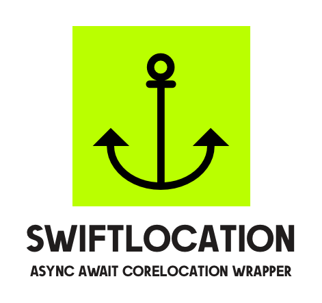

<p align="center">
<picture>
  <source media="(prefers-color-scheme: dark)" srcset="./assets/swiftlocation-dark.png" width="350">
  
</picture>
</p>

[](#installation)
[](https://img.shields.io/badge/Swift-5.5_5.6_5.7_5.8_5.9-Orange?style=flat-square)
[](https://img.shields.io/badge/Swift_Package_Manager-compatible-orange?style=flat-square)

**SwiftLocation is a lightweight wrapper around Apple's CoreLocation framework that supports the new Swift Concurrency model.**  

*This means **no more delegate pattern to deal with, nor completion blocks**.  
You can manage location requests, region, and beacon monitoring directly using the new async/await syntax.*

Would you, for example, get the current user location?  
*It's just 2 lines code away:*

```swift
try await location.requestPermission(.whenInUse) // obtain the permissions
let userLocation = try await location.requestLocation() // get the location
```

# How it works

SwiftLocation is quite straightforward to use.  
Simply create your own `Location` instance and use one of the available methods.

> [!IMPORTANT]  
> Some APIs may not available under some of the supported platforms due to specific hardware constraints.

- [How it works](#how-it-works)
  - [What's new in 6.0](#whats-new-in-60)
  - [Service Location Status](#service-location-status)
  - [Authorization Status](#authorization-status)
  - [Accuracy Authorization Level](#accuracy-authorization-level)
  - [Request Location Permission](#request-location-permission)
    - [Provide descriptions of how you use location services](#provide-descriptions-of-how-you-use-location-services)
  - [Request Temporary Precision Permission](#request-temporary-precision-permission)
  - [Continous Location Monitoring](#continous-location-monitoring)
  - [Request One-Shot User Location](#request-one-shot-user-location)
  - [Visits Monitoring](#visits-monitoring)
  - [Significant Location Changes Monitoring](#significant-location-changes-monitoring)
  - [Device Heading Monitoring](#device-heading-monitoring)
  - [Beacon Ranging](#beacon-ranging)
- [Testing Suite \&  Mocked CLLocationManager](#testing-suite---mocked-cllocationmanager)
- [Installation via SPM](#installation-via-spm)
- [Support This Work ❤️](#support-this-work-️)
- [License](#license)
- [Contributing](#contributing)

## What's new in 6.0

The new 6.0 milestone is a completely rewritten version designed to support async/await optimally. We are also focused on supporting all CoreLocation features without creating an overwhelmed package.  
All the features are supported by a complete unit tests suite.

This new version is also distributed only via Swift Package Manager (5.5+) and it's compatible with all the Apple Platforms: iOS 14+, macOS 11+, watchOS 7+, tvOS 14+.

*The features from version 5.x - geocoding, ip resolve, autocomplete - will be included as separate downloadable modules later in the development process.*

## Service Location Status

Use the `location.locationServicesEnabled` to get the current status of the location services.  
In order to monitor changes you can use the `AsyncStream`'s startMonitoringLocationServices()` method:

```swift
for await event in await location.startMonitoringLocationServices() {
 print("Location Services are \(event.isLocationEnabled ? "enabled" : "disabled")"
 // break to interrupt the stream
}
```

You can stop the stream at any moment using `break`; it will call the `stopMonitoringLocationServices()` automatically on used `Location`` instance.

## Authorization Status

You can obtain the current status of the authorization status by using the `location.authorizationStatus` property.  
If you need to monitor changes to this value you can use the `AsyncStream` offered by `startMonitoringAuthorization()` method:

```swift
for await event in await location.startMonitoringAuthorization() {
  print("Authorization status did change: \(event.authorizationStatus)")
  // break to interrupt the stream
}
```

## Accuracy Authorization Level

The `location.accuracyAuthorization` offers a one shot value of the current precision level offered by your application.  
When you need to monitor changes you can use the `AsyncStream` offered by `startMonitoringAccuracyAuthorization()`:

```swift
for await event in await location.startMonitoringAccuracyAuthorization() {
  print("Accuracy authorization did change: \(event.accuracyAuthorization.description)")
  // break to interrupt the stream
}
```

## Request Location Permission

Also the request location permission is managed via async await. You can use the `requestPermission()` method once you have properly configured your `Info.plist` file:

```swift
// return obtained CLAuthorizationStatus level
let obtaninedStatus = try await location.requestPermission(.whenInUse)
```

### Provide descriptions of how you use location services

The first time you make an authorization request, the system displays an alert asking the person to grant or deny the request. The alert includes a usage description string that explains why you want access to location data.  

You provide this string in your app’s Info.plist file and use it to inform people about how your app uses location data.

Core Location supports different usage strings for each access level. You must include a usage description string for When in Use access. If your app supports Always access, provide an additional string explaining why you want the elevated privileges. The following table lists the keys to include in your Info.plist and when to include them.

| Usage key                                                 | Required when:                                                                   |
|-----------------------------------------------------------|----------------------------------------------------------------------------------|
| `NSLocationWhenInUseUsageDescription`              | The app requests When in Use or Always authorization.                            |
| `NSLocationAlwaysAndWhenInUseUsageDescription` | The app requests Always authorization.                                           |
| `NSLocationTemporaryUsageDescriptionDictionary`             | Used when you want to temporary extend the precision of your authorization level |
|                                                           |                                                                                  |

## Request Temporary Precision Permission

If the App does not require an exact location for all of its features, but it is required to have accurate one only for specific features (i.e during checkout, booking service, etc) — then App may ask for temporary accuracy level for that session only using the `requestTemporaryPrecisionAuthorization(purpose:)` method:

```swift
// return CLAccuracyAuthorization value
let status = try await location.requestTemporaryPrecisionAuthorization(purpose: "booking")
```

## Continous Location Monitoring

If you need to continous monitoring new locations from user's device you can use the `AsyncStream` offered by `startMonitoringLocations()`:

```swift
for await event in try await location.startMonitoringLocations() {
    switch event {
    case .didPaused:
	// location updates paused
    case .didResume:
    // location updates resumed
    case let .didUpdateLocations(locations):
    // new locations received   
    case let .didFailed(error):
    // an error has occurred   
    }
    // break to stop the stream
}
```

## Request One-Shot User Location

Sometimes you may need to get the user location as single value. The async's `requestLocation(accuracy:timeout:)` method was created to return an optionally filtered location within a valid time interval:

```swift
// Simple implementation to get the last user location
let location = try await location.requestLocation()

// Optionally you can return a value only if satisfy one or more constraints
let location = try await location.requestLocation(accuracy: [
    .horizontal(100) // has an horizontal accuracy of 100 meters or lower
], timeout: 8) // wait for response for a max of 8 seconds
```

Filters include horizontal/vertical, speed, course accuracy and it offer the opportunity to set a custom filter functions as callback.

## Visits Monitoring

Visits monitoring allows you to observe places that the user has been.  
Visit objects are created by the system and delivered by the CLLocationManager. 
The visit includes the location where the visit occurred and information about the arrival and departure times as relevant.

To monitor visits you can use the `AsyncStream`'s `startMonitoringVisits()` method:

```swift
for await event in await location.startMonitoringVisits() {
    switch event {
    case let .didVisit(place):
    // a new CLVisit object has been received.   
    case let .didFailWithError(error):
    // an error has occurred
    }
}
```

## Significant Location Changes Monitoring

The `AsyncStream`'s `startMonitoringSignificantLocationChanges()` method starts the generation of updates based on significant location changes.

```swift
for await event in await self.location.startMonitoringSignificantLocationChanges() {
    switch event {
    case .didPaused:
    // stream paused
    case .didResume:
    // stream resumed
    case .didUpdateLocations(locations):
    // new locations received
    case let .didFailWithError(error):
    // an error has occured
    }
	// break to stop the stream
}
```

## Device Heading Monitoring

To get updates about the current device's heading use the `AsyncStream` offered by `startUpdatingHeading()` method:

```swift
for await event in await self.location.startUpdatingHeading() {
	// a new heading value has been generated
}
```

## Beacon Ranging

Beacon ranging is offered by the `AsyncStream`'s `startRangingBeacons()` method:

```swift
let constraint: CLBeaconIdentityConstraint = ...
for await event in await location.startRangingBeacons(satisfying: constraint) {
	// a new event has been generated
}
```

# Testing Suite &  Mocked CLLocationManager

SwiftLocation is distribuited with an extensive unit testing suite you can found into the `SwiftLocationTests` folder.  
Inside the suite you will also found the `MockedLocationManager.swift` file which is a `CLLocationManager` mock class you can use to provide the testing suite for your application. By configuring and extending this file you will be able to mock results of location requests and monitoring directly in your host app.


# Installation via SPM

SwiftLocation is offered via Swift Package Manager.  
Add it as a dependency in a Swift Package, and add it to your `Package.swift`:

```swift
dependencies: [
  .package(url: "https://github.com/malcommac/SwiftLocation.git", from: "6.0.0")
]
```
# Support This Work ❤️

If you love this library and wanna encourage further development **consider becoming a sponsor of my work** via [Github Sponsorship](https://github.com/sponsors/malcommac).  

# License

This package was created and maintaned by [Daniele Margutti](https://github.com/malcommac).  

- [LinkedIn Profile](https://www.linkedin.com/in/danielemargutti/)
- [X/Twitter](http://twitter.com/danielemargutti)
- [Website](https://www.danielemargutti.com)

It was distribuited using [MIT License](https://github.com/malcommac/SwiftLocation/blob/master/LICENSE.md).

# Contributing

- If you need help or you'd like to ask a general question, open an issue.
- If you found a bug, open an issue.
- If you have a feature request, open an issue.
- If you want to contribute, submit a pull request.

Read the [CONTRIBUTING](CONTRIBUTING.md) file for more informations.
